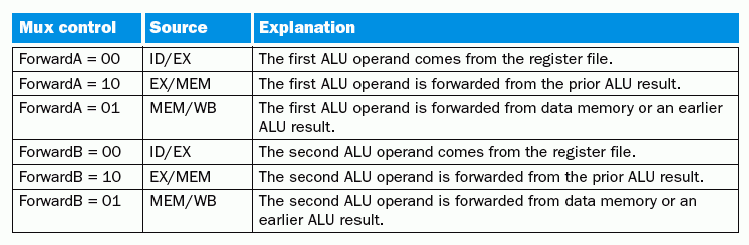

Introducción
============

En este trabajo se implementa y verifica un procesador DLX utilizando el
lenguaje de programación Python_ mediante el uso del paquete MyHDL_. El
proyecto se ha llamado **PyMIPS**.

El DLX es básicamente un procesador MIPS revisado y simplificado con una arquitectura
RISC de 32 bits y un pipeline de 5 etapas. (ver Segmentación_ ). Ha sido pensado
principalmente para propósitos educativos, y se utiliza ampliamente en cursos de
nivel universitario sobre arquitectura de computadoras.

El desarrollo de este trabajo ha sido guiado principalmente por el libro
"Computer Organization and Design" [Patterson-Hennessy2005]_, escrito por David Patterson y John Hennessy, diseñadores originales del procesador DLX.

El código fuente, la documentación y la visualización de la historia de desarrollo
puede encontrarse en el sitio web http://github.com/nqnwebs/pymips.
El trabajo ha sido liberado bajo licencia GNU GPL v3.0 [1]_ .

Lenguaje de implementación
==========================

Python es un lenguaje de programación de alto nivel cuya filosofía hace hincapié
en una sintáxis clara y legible.

Se trata de un lenguaje de programación multiparadigma ya que soporta
orientación a objetos, programación imperativa y funcional. Es un lenguaje interpretado,
usa tipado dinámico, es fuertemente tipado y es multiplataforma.

MyHDL es un paquete (un conjunto de módulos y funciones Python) que permite utilizar
la potencia de alto nivel de Python en reemplazo de un lenguaje de descripción de hardware
tradicional. Más aun, con algunas restricciones menores, el código Python-MyHDL
es convertible a VHDL o Verilog automáticamente. Puede verse un detalle de
característicsa y ejemplos en el manual de usuario [MyHDLDoc]_.

También es posible generar un archivo de descripción de forma de onda de las
señales (archivos *\.vcd*) implicadas en un determinado diseño.

Es importante destacar que MyHDL_ permite valerse de la potencia de Python
como lenguaje de alto nivel, pero sin salirse del *scope* de la descripción
de hardware. Por ello, muchos conceptos son comunes (señales, bus, bits,
enteros con y sin signo, testbench, etc) así como las técnicas de modelado
(estructural, comportamental, etc.). Semánticamente es muy similar a
Verilog, aunque la posibilidad de instrospección de Python permite automatizar
e inferir aspectos, por ejemplo, el comportamiento de los puertos (se detecta
si es un puerto de entrada o salida).

En el artículo [WhyMyHDL]_ se detallan muchas ventajas de su uso. Entre ellas
se destacan:

 * Facilidad de uso: Python es mucho más fácil de aprender que VHDL o Verilog
 * Uso de técnicas modernas de desarrollo de software aplicadas al diseño de hardware:
   por ejemplo, pruebas unitarias, y la metodológia asociada *“test-driven development”*
 * Unificar diseño algoritmico y descripción de hardware
 * Centralizar el desarrollo cuando hay que codificar lo mismo en VHDL y Verilog
 * y mucho más...

.. [1] http://www.gnu.org/licenses/gpl.html

Arquitectura
=============

Segmentación
------------

El interior del procesador DLX está segmentado en cinco etapas de pipeline y
en cada una de ellas se realizarán las operaciones de las tareas en el ciclo
normal de una instrucción, es decir, búsqueda de la instrucción
(identificado con el bloque IF), decodificación de la instrucción
(identificado con el bloque ID), ejecución de la operación
(identificado con el bloque EX), acceso a memoria
(identificado con el bloque MEM) y almacenamiento del resultado de la
operación (identificado con el bloque WB).

 .. image:: img/segmentation.png
    :align: center
    :width: 80 %

La ejecución de las instrucciones se superponen en el tiempo de la siguiente
manera:

 .. image:: img/overlapping.png
    :width: 80 %
    :align: center

Implementación
==============

El desarrollo de PyMIPS ha sido realizado iterativa e incrementalmente. En
una primera estapa se codificó y verificó cada uno de los componentes internos
del procesador. Luego, a nivel estructural, se instanciaron y conectaron
estos componentes (mediante señales internas) en una versión sin pipeline,
(Datapath_), una versión con pipeline pero sin control de hazards (Pipeline_),
y la versión definitiva con segmentación y control de hazards,
mediante forwarding y detección de saltos (`DLX`).

La codificación de cada componente respeta las restricciones RTL de MyHDL
para ser convertible a lenguajes HDL sintetizables. En particular, para una
una comparación, se incluye el resultado de conversión automática a VHDL
estándar.

Todos estos componentes han sido verificados y simulados mediante *testbenchs*
y/o *unittests*. Ambas técnicas permiten conectar señales a los puertos de
entrada y salida del componte y observar su comportamiento en función de
distintos estímulos que se generan. La diferencia radica en que los
*unittest*, herramienta incluída en lenguajes orientados a objetos como Java
y C++ y parte neurálgica de modelos de desarrollo ágiles, permiten la verificación automática comparando el estado de una señal en un determinado momento con un el valor esperado para esa condición.

Esta automatización, en contraste con la inspección manual mediante el dump
de forma de onda o la impresión por pantalla, permite una verificación mucho
más fiable y rápida.

Convenciones de codificación
-----------------------------

Sobre todo en las implementación a nivel estructural (las distintas versiones
del procesador) la cantidad de señales internas e instancias de componentes
es grande. Para facilitar la diferenciación semántica de cada *objeto* se
definió la siguiente convención:

    * La señales se definen en ``CamelCase``

    * La instancias de componente se escriben como ``under_score_`` (con un
      ``_`` al final)

    * La señales que se comparten por dos o más etapas (que atraviesan un
      latch) tiene como sufijo la etapa de pipeline a la que pertenencen.
      Por ejemplo: ``PcAdderO_if``, que se encuentra antes del latch ``IF/ID``
      es la misma señal que ``PcAdderO_id`` después del latch.

Componentes
-----------

Program Counter
+++++++++++++++

El contador de programa funciona como un latch. Cuando llega el flanco de
clock (descendiente), el valor del puerto de salida se actualiza con el valor
del puerto de entrada en ese instante.

.. aafig::
    :aspect: 60
    :scale: 150
    :proportional:
    :align: center

            +---------+
            |         |
       IN >-|   PC    |-> Out
            |         |
            +---------+
                 ^
                Clk

.. literalinclude:: ../../program_counter.py
   :pyobject: program_counter

Luego de la conversión a VHDL, el código generado es el siguiente

.. literalinclude:: ../../vhdl/program_counter.vhd
    :lines: 12-

Para la verificación se realizó el siguiente *TestBench* que emula el uso en
el contexto real donde el valor de salida (el contador) se incremeta a traves
de un sumador

.. literalinclude:: ../../program_counter.py
   :pyobject: testbench

El resultado es el siguiente:

.. program-output:: python /home/tin/facu/arq/project/program_counter.py
   :nostderr:

Instruction Memory
++++++++++++++++++

.. aafig::
    :aspect: 60
    :scale: 150
    :proportional:
    :align: center

              +----------------+
              |                |
     'Read' >-|   Instruction  |-> Instruction [31:0]
     'Addr'   |     Memory     |
              |                |
              +----------------+
                     ^
                    Clk

Una de las características de la arquitectura Hardvard del DLX es la
separación de la memoria de programa de la memoria de datos.
La memoria de programas funciona como una memoria ROM. En particular
el diseño implementado distribuye la memoria en bancos de 32 bits en vez de
bytes. Esto tiene implicancia en que el incremento entre una instrucción
y otra es de 1 en 1, en vez de ser de 4 como utiliza el diseño de la
bibliografía.

Cuando llega un flanco descendiente en el clock, el dato guardado en la
dirección de memoria de entrada se asigna a la salida.

.. literalinclude:: ../../instruction_memory.py
   :pyobject: instruction_memory

Por simplicidad, no se incluye el código autogenerado de la conversión a
VHDL, pero como para todos los componentes, puede encontrarse en la carpeta
* ./vhdl *

Para cargar de información la memoria ROM, se escribió una pequeña función
que lee un archivo de texto, considerando el *token* ``#`` como el inicio
de un cometario. Además, no se consideran los espacios, de manera que el
resultado es un número binario de 32 digitos (una instrucción de programa).

.. literalinclude:: ../../instruction_memory.py
   :pyobject: load_program

El testbench lee las 8 primeras posiciones:

.. literalinclude:: ../../instruction_memory.py
   :pyobject: testBench

cuyo resultado es el siguiente:

.. program-output:: python /home/tin/facu/arq/project/instruction_memory.py
   :nostderr:

Instruction Decoder
+++++++++++++++++++

En los 32 bits de instrucción se codifican distintas informaciones: opcode,
función, registro source, target y destiny, etc. Para realizar esta
separación se implementó un simple decodificador combinacional.

.. literalinclude:: ../../instruction_decoder.py
   :pyobject: instruction_dec

Unidad de control
+++++++++++++++++

.. aafig::
    :aspect: 60
    :scale: 150
    :proportional:
    :align: center
    :textual:

              /----------------\
              |                |-> 'RegDst'
     NopSig >-|     Control    |-> 'Branch'
              |                |-> 'MemRead'
     Opcode >-|                |-> 'MemtoReg'
              |                |-> 'ALUOp (2bits)'
              |                |-> 'MemWrite'
              |                |-> 'ALUSrc'
              |                |-> 'RegWrite'
              \----------------/

La unidad de control es un componente combinacional que activa *flags*, en
general para el control de multiplexores u otras unidades de control
secundarias. Cumple la siguiente tabla de verdad:

.. image:: img/control_table.png
   :width: 90%

Para satisfacer la detección de ``nop`` (instrucción ``0x00000``) se
incorporó como entrada una señal detectada en ID, que es ``1`` si toda la
instrucción es ``0``. En tal caso , la unidad de control pone todas sus
salidas a ``0``.

La modificación  se debe a que el opcode ``00000`` es común para las
instrucciones R-type y algunas señales de
control se ponen a ``1`` causando efectos no deseados como la escritura en el
banco de registros.

El código de implementación es el siguiente

.. literalinclude:: ../../control.py
   :pyobject: control

El testbench desarrollado itera sobre distintas entradas de opcode:

.. literalinclude:: ../../control.py
   :pyobject: testBench

Cuyo salida estándar es la siguiente:

.. program-output:: python /home/tin/facu/arq/project/control.py
   :nostderr:

Multiplexores
+++++++++++++

Para seleccionar una u otra entrada en función de señales gestionadas por
unidades de control se utilizan multiplexores, en particular de 2x32 (2
canaes de 32 bits) y 4x32.

.. aafig::
    :aspect: 60
    :scale: 150
    :proportional:
    :align: center

            /-----\
      Ch0 >-|     |
            | MUX |-> Out
      Ch1 >-|     |
            \-----/
               ^
              Sel

Si el selector es 0, la salida se conectará con el canal 0, y análogamente
si es 1 la salida será el canal 1. Para los multiplexores de 4 canales, el
selector en una señal de 2 bits.

.. literalinclude:: ../../mux.py
   :pyobject: mux2

El testbench genera entradas y selectores al azar e imprime la salida. Una
salida es la siguiente:

.. program-output:: python /home/tin/facu/arq/project/mux.py
   :nostderr:

Banco de Registros
++++++++++++++++++

El DLX cuenta con un banco de 32 registros de propósito general. Tiene la
particularidad de que en un mismo ciclo puede leer 2 registros
simultáneamente (en el flanco de bajada) y escribir, si está habilitada la
correspondiente señal de escritura, 1 registro en el flanco de subida del
clock.

.. aafig::
    :aspect: 60
    :scale: 150
    :proportional:
    :align: center
    :textual:

                        RegWrite
                           v
                           |
                  +----------------+
                  |                |-> ReadData1
       ReadReg1 >-|    Register    |
                  |     File       |-> ReadData2
       ReadReg2 >-|                |
                  |                |
       WriteReg >-|                |
                  |                |
      WriteData >-|                |
                  +----------------+
                          ^
                         Clk

ALU
+++

.. aafig::
    :aspect: 60
    :scale: 150
    :proportional:
    :align: center
    :textual:

                  +-------+
                  |        \
          Data1 >-+         \
                  +          \
                   \          +
                    \         |
                     \  ALU   |-> Result
                     /        |
                    /         |-> Zero
                   /          +
                  +          /
          Data2 >-+         /
                  |        /
                  +-------+
                     ^
                    Control

La unidad aritmético-lógica es la encargada de realizar las operaciones.
El operando de 32bits ``Data1`` recibe el dato del registro 1 (``Rs``) y ``Data2``
puede ser tanto otro dato almacenado en un registro (``Rt``) o bien un valor
literal. Las operaciones que soporta esta implementación son las que se
detallan en la siguiente tabla.

.. image:: img/alu_op.png
   :align: center

La implementación es la siguiente:

.. literalinclude:: ../../alu.py
   :pyobject: ALU

El testbench genera inputs al azar e intera sobre los valores de gestión
válidos. La salida es la siguiente

::

    Control: 0000 | 252 AND 184 | 184 | z=0
    Control: 0001 | 137 OR 175 | 175 | z=0
    Control: 0010 | 113 add 148 | 261 | z=0
    Control: 0110 | 77 substract 166 | -89 | z=0
    Control: 0111 | 158 < 10 | 0 | z=1
    Control: 1100 | 238 NOR 237 | -240 | z=0

ALU Control
+++++++++++

La unidad de control de ALU es un componente combinacional de control
secundario. Recibe una señal de 2 bits de la unidad de control y la función
codificada en los 6 bits menos significativos de la instrucción.
Genera la señal de control de 4 bits correspondiente para controlar la
operación de la ALU.

.. aafig::
    :aspect: 60
    :scale: 150
    :proportional:
    :align: center

            /---------\
    ALUop >-|         |
            |   ALU   |-> AluControl (4bits)
     Func >-| Control |
            \---------/

La tabla de verdad es la siguiente:

.. image:: img/alu_control.png
   :align: center

La implementación es la siguiente:

.. literalinclude:: ../../alu_control.py
   :pyobject: alu_control

El testbench se codificó de la siguiente manera:

.. literalinclude:: ../../alu_control.py
   :pyobject: testBench_alu_control

Sign Extender
+++++++++++++

El extensor de signo convierte un dirección (offset) o un literal codificado
en 16 bits (bits 15 a 0 de la instrucción) en un entero de igual valor pero
representado en 32 bits, lo que permite usarlo como operador en la ALU o en
el sumador para saltos condicionales.

.. aafig::
    :aspect: 60
    :scale: 150
    :proportional:
    :align: center

            +------------+
            |            |
     IN16 >-|   Sign     |-> Out32
            |  Extender  |
            |            |
            +------------+

.. literalinclude:: ../../sign_extender.py
   :pyobject: sign_extend

Se muestra tambien la conversión a VHDL

.. literalinclude:: ../../vhdl/sign_extend.vhd
    :lines: 12-

El resulado del testbench es el siguiente:

.. program-output:: python /home/tin/facu/arq/project/sign_extender.py
   :nostderr:

Data Memory
+++++++++++

La memoria de datos (RAM) permite almacenar y recuperar información. En el
MIPS y derivados, sólo se interactua con este dispositivo a través de las
operaciones ``store`` y ``load``.

.. aafig::
    :aspect: 60
    :scale: 150
    :proportional:
    :align: center
    :textual:

                        MemWrite
                           v
                  +--------+-------+
                  |                +-> ReadData
        Address >-+     'Data'     |
                  |    'Memory'    |
      WriteData >-+                |
                  |                |
                  +--+-------+-----+
                     ^       ^
                    Clk    MemRead

En cierta forma funciona similar al banco de registros, pero se lee una
dirección a la vez y existen señales de habilitación tanto para escritura
como para lectura. La lectura o la escritura se produce en el flanco de bajada
de la señal de clock, teniendo prioridad la escritura, siempre y cuando las
correspondientes señales estén en ``1``.

La implementación es la siguiente

.. literalinclude:: ../../data_memory.py
   :pyobject: data_memory

La conversión a código VHDL se detalla a continuación:

.. literalinclude:: ../../vhdl/data_memory.vhd
    :lines: 12-

El testbench realiza escrituras de valores al azar (enteros con signo de 32
bits) en 5 direcciones aleatorias. Luego realiza la lectura de esas
direcciones. Se codificó de la siguiente manera:

.. literalinclude:: ../../data_memory.py
   :pyobject: testBench

y resultado se lista a continuación:

.. program-output:: python /home/tin/facu/arq/project/data_memory.py
   :nostderr:

Forwarding unit
+++++++++++++++

La parelización del pipeline se basa en la superposición de las distintas etapas
de ejecución de cada instrucción. En los casos en que una instrucción depende
del resultado de una precedente se produce un hazard de datos.

Por ejemplo::

    add $r1, $r2, $r3
    sub $r5, $r1, $r4

En este caso, la 2º instrucción necesita como operando el resultado en el registro
1 de la operación precedente, que en el flujo normal del pipeline no estará disponible
hasta la etapa de WB (5º ciclo). Sin embargo, en este tipo de dependencias,
una solución el la técnica de *forwarding* o cortocircuito. Concretamente, el resultado
de la primera operación ya se conoce en la etapa de ejecución, por lo que puede
cortocircuitarse este resultado para que justo un ciclo después (cuando el valor
de la suma ``$r2 + $r3`` esté en la etapa MEM) reemplace al valor de ``$r1``
como primer operando de la ALU.

Este control de dependencia de datos lo realiza la unidad de forwarding.
Detecta un 2 pares de condiciones: que el registro destino (``Rd``) de una instrucción
en etapa de memoria (el caso del ejemplo) o en WB (que se produce cuando
hay dependencia de datos entre dos instrucciones separadas por una no dependendiente)
es el mismo que alguno de los operandos (``Rs`` o ``Rt``) de la instrucción
en etapa EX.

Para no hacer forwarding innecesariamente (hay instrucciones que no escriben datos)
se controla también si la señal de control ``RegWrite`` en etapa MEM está activa.

.. aafig::
    :aspect: 60
    :scale: 150
    :proportional:
    :align: center
    :textual:

                  Forw A   Forw B
                     ^        ^
                     |        |
                  +--+--------+----+
                  |                +-< Rd_mem
          Rs_ex >-+  'Forwarding'  |
                  |    'Unit'      +-< Rd_wb
          Rt_ex >-+                |
                  |                |
                  +--+----------+--+
                     ^          ^
                'RegWrite'   'RegWrite'
                 '(mem)'       '(wb)'

Esta unidad produce dos señales de control (``ForwardA`` y ``ForwardB``) de 2 bits
que puede tomar valores 0, 1 o 2 para controlar sendos multiplexores a la entradas
de la ALU. La significación de cada valor se describe en esta tabla:

La implementación de este componente es la siguiente:

.. literalinclude:: ../../forwarding.py
   :pyobject: forwarding

En reemplazo de un TestBench se ha realizado una seria de pruebas de unitarias
que prueban distintas combinaciones de la señales de entrada y verifican que
el resultado de la señal de control para cada multiplexor sea correcto.

Esos test se detallan en el código implementado:

    .. literalinclude:: ../../forwarding.py
       :pyobject: testBench

Al ejecutar el módulo Python, el framework para *Unittest* incorporado de manera
estándar con el lenguaje ejecuta el método ``setUp`` previamente
y luego cada uno de las pruebas (métodos de la clase
``testBench`` que comienzan con el prefijo ``test_``) y verifica el resultado
de las aserciones. Por supuesto, en la implemtación todos los test son satisfechos:

::

    ----------------------------------------------------------------------
    Ran 6 tests in 0.362s

    OK

Hazard detector
++++++++++++++++

Existe un caso de dependecia de datos que no puede resolverse mediante *forwarding*.
Es el caso cuando un dato necesario para ejecutar una instrucción depende de la
lectura desde memoria en una instrucción precedente:

Por ejemplo::

    lw $r1, 5($r1)
    add $r2, $r1, $r3

En este ejemplo el valor de ``$r1`` según la primera instrucción deberá ser
el valor de la posición de memoria ``$r1 + 5``, pero esto no sucederá hasta la etapa
de WriteBack en el 5to ciclo, mientras que dicho dato es necesario en el 4to ciclo
en la etapa de ejecución de la instrucción ``add``.

La solución en este caso es "pausar" (*stall*) el pipeline por un ciclo para permitir
que la lógica de forwarding pueda manejar la dependencia.

.. aafig::
    :aspect: 60
    :scale: 150
    :proportional:
    :align: center
    :textual:

                  Stall
                     ^
                     |
                  +--+--------+----+
                  |                +-< Rt_ex
          Rs_id >-+  'Hazard'      |
                  |    'Detector'  |
          Rt_id >-+                |
                  |                |
                  +--+-------------+
                     ^
                'MemRead'
                 '(ex)'

La señal de *Stall* inhibe el incremento del contrador de programa (PC) y del latch
``IF/ID``. Además pone a 0 todas las señales de control, de manera que ningún dato
sea grabado (ya sea en el banco de registros o en la memoria de datos).
Esto es, básicamente, instroducir una instrucción ``nop`` (*no operation*) entre
la instrucción de carga y la r-type::

    lw $r1, 5($r1)
    nop
    add $r2, $r1, $r3

El código de implementación de esta unidad es el siguiente:

.. literalinclude:: ../../forwarding.py
   :pyobject: forwarding

Los test unitarios se detallan en el siguiente código:

.. literalinclude:: ../../forwarding.py
   :pyobject: testBench

Latchs
++++++

Un latch es dispositivo secuencial que refresca los puertos de salida con los valores
de los puertos de entrada correspondientes ante el flanco (positivo) de una señal
de clock o trigger. Además puede incorporar una señal de Reset o Flush, que
pone todos los puertos de salida a 0 independientemente del valor de las entradas,
y también una señal de *Stall* o inhibidor, que mantiene el valor previo de los
puertos de salida en caso de estar a 1.

.. aafig::
    :aspect: 60
    :scale: 150
    :proportional:
    :align: center

                +------------+
                |            |
       Inputs >-|            |-> Outputs
                |  latch     |
                |            |
                +-+---+----+-+
                  ^   ^    ^
                 Clk Rst 'Stall'

Los *latchs* se encargan de retener y estabilizar los datos entre las etapas.
manteniendo la integridad de las señales.
Son los componentes claves para permitir la paralelización de la etapas.

Como nomenclatura, cuando se menciona el componente ``IF/ID`` se refiere al
latch entre la etada *Intruction Fetch (IF)* e *Intruction Decoder (ID)*.

Todos los componentes de este tipo son análogos, por lo que sólo se mostrará en
este reporte el código de  ``IF/ID`` y su correspondiente TestBench.

.. literalinclude:: ../../latch_if_id.py
   :pyobject: latch_if_id

El testbench genera señales de Clock, Reset y Stall aleatoriamente (con cierta
probabilidad).

.. literalinclude:: ../../latch_if_id.py
   :pyobject: testBench

Un resultado es el siguiente:

.. program-output:: python /home/tin/facu/arq/project/latch_if_id.py
   :nostderr:

Datapath
--------

El datapath es la versión sin pipeline del procesador. Responde al siguiente
diseño:

 .. image:: img/datapath.png
    :width: 100 %

La característica de esta implementación es que las instrucciones no se
solapan, por lo que el proceso es ejecutar una instrucción desde el inicio
hasta el fin (4 o 5 ciclos) para recién comenzar a ejecutar la siguiente
instrucción. Por ello es que la frecuencia de incremento del PC es 4 o 5 veces
mayor que la del clock general del sistema

En el archivo *datapath.py* puede encontrarse su implementación.

Pipeline
--------

Una versión preliminar del procesador con pipeline se encuentra en el archivo
*pipeline.py* . Esta versión implementa la paralelización mediante el uso
de los latchs pero no gestiona el control de hazards.

Responde al siguiente diseño [2]_:

 .. image:: img/pipeline.png
    :width: 100 %

.. [2] El diagrama ha sido levemente simplificado y por una cuestión de
       claridad se suprimen los nombres de algunas señales

DLX
---

Es el procesador completo incorpora la unidad de forwarding y la detección de
hazards.

El conexionado de la unidad de forwarding se ilustra en el siguiente gráfico:

 .. image:: img/forwarding_conections.png
    :width: 100 %

Una representación general [3]_ del DLX se muestra en la siguiente figura:

 .. image:: img/dlx_simplified.png
    :width: 100 %

.. [3] La etapadas ID y EX están simplificadas (extensor de signo y lógica
       de control de branch no se muestran).

El archivo de código fuente *dlx.py* contiene la implementación, a nivel
estructural, del procesador completo.

Como se explica en la descripción de cada componente, la *unidad de
forwarding* implementa la lógica para hazard de datos entre instrucciones r-types de 1 o
2 saltos, mientras que el *hazard detector* aplica la técnica de la
inserción de *stalls* aplicables a los hazard de datos del tipo  *Read after
Load* y los hazard de control o branch.

Ejemplo de Forwarding
++++++++++++++++++++++

Para ejemplificar el funcionamiento del forwarding se ejecuta en el DLX el
siguente programa :

   ====================  ==========================================
     ensamblador           instrucciones compiladas
   ====================  ==========================================
    add $r1, $r2, $r3     000000 00010 00011 00001 00000 100000
    sub $r5, $r1, $r4     000000 00001 00100 00101 00000 100010
   ====================  ==========================================

Dada la inicialización del banco de registros al valor ``i+1`` para cada
registro i, las operaciones precedentes equivalen al siguiente pseudocódigo:

   ==============  ============  ======================
    pseudocódigo    operadores    resultado esperado
   ==============  ============  ======================
    r1 = r2 + r3    r1 = 3 + 4    r1 = 7
    r5 = r1 - r4    r5 = 7 - 5    r5 = 2
   ==============  ============  ======================

En el archivo *dump_raw_forw.txt* se encuentra la salida estándar completa
para una simulación durante 6 ciclos de reloj de ejecución de este programa.

Las claves de la correción en la ejecución son:

* El forwarding se produce en el 4to ciclo::

    ForwardA 2

* El multiplexor intervenido es el A (primer operando de la ALU) debido a que
  el destino (``Rd``) de la 1º instrucción es el mismo que el primer
  operador (``Rs``) de la segunda.

* En el 4to ciclo puede observarse que si bien ``Data2`` (el verdadero valor de
  ``r1`` en ese instante) es ``2``, debido al forwarding el operando que ingresa a
  la ALU es ``7``, que efectivamente el resultado de la operación ALU previa::

    AluResult_mem 7

* Al final, puede observarse que el estado del los primeros bancos de registros en el
  6º ciclo es::

    reg: [1, 7, 3, 4, 5, 2]

  Lo cual es correcto.

Ejemplo de hazard *Read after Load*
+++++++++++++++++++++++++++++++++++++

El programa que se simula en este caso es el siguiente:

   ====================  ==========================================
     ensamblador           instrucciones compiladas
   ====================  ==========================================
    lw $r1, 5($r1)          100011 00001 00001  0000000000000101
    add $r2, $r1, $r3       000000 00001 00011 00010 00000 100000
   ====================  ==========================================

Como antes, los registros se inicializan al valor ``i + 1``, y la posición
de memoria 7 se inicializa a ``51`` (valor arbitrario)

La significación y los resultados esperados se resumen en la siguiente tabla:

   ==================  =============  ======================
    pseudocódigo        operadores     resultado esperado
   ==================  =============  ======================
    r1 = Mem[r1 + 5]    r1 = Mem[7]      r1 = 51
    r2 = r1 + r3        r2 = 51 + 4      r2 = 55
   ==================  =============  ======================

En el archivo *dump_raw_stall.txt* se encuentra la salida estándar completa
para una simulación durante 7 ciclos de reloj de ejecución de este programa.

La claves de interpretación se resumen a continuación:

*  En el 3º ciclo, cuando la segunda instrucción llega a la etapa ID, se
   detecta el hazard y se produce el stall. En la línea 110 del dump se
   observa::

    Stall --> 1

* Esto repercute en que todas las señales de control a partir de ese ciclo se
  ponen a 0::

    RegDst 0  ALUop 00  ALUSrc 0 | Branch 0  MemR 0  MemW 0 |  RegW 0 Mem2Reg 0

* Y que durante el siguiente ciclo (el 4to), la instrucción en IF es
  la misma (2297888 en decimal)

* En el 5to ciclo la unidad de forwarding ya puede cortocircuitar el
  dato solicitado a memoria (``ForwardA 1``) haciendo que el operador para la
  etapa de ejecución sea ``51`` en vez de ``2`` que es el valor de ``Data1``
  en ese instante.

* Debido a este *stall* la cantidad de ciclos usados para ejecutar el
  programa completo es 6 en vez de 5 como en el ejemplo de hazard de datos
  anterior, donde el dato podía encontrarse en una etapa precedente y
  resolverse directamente por forwarding

* Al final de la simulación puede observarse que el estado del banco de
  registros es el siguiente::

    reg: [1, 51, 55, 4, 5, 6]

  Lo cual es correcto.

Ejemplo de hazard de control
++++++++++++++++++++++++++++

Los hazard de control o branch se producen cuando hay un salto condicional.
Para saber si el salto debe realizarse o se debe seguir procesando
linealmente es necesario conocer el resultado de la operación de la condición
(en la implementación del DLX la única instrucción de este tipo es ``beq``,
*branch on equal*,  que realiza una resta con lo operando de la ALU y verifica
el flag ``Zero`` ).

Dado que para realizar esta operación es necesario que la instrucción llegue
a la etapa de ejecución (3 ciclos) debe definirse una estrategia que permita
aprovechar el procesamiento de la etapas previas a EX para procesar otras
instrucciones.

La estrategia más simple, que es la implementada en este proyecto, es definir
que *a priori* el resultado de la condicion siempre es falso, es decir que el
*branch* no se toma. Si al obtener el resultado verificamos que la decisión
anticipada fue correcta, se habrán ganado dos ciclos de reloj  (las
intrucciones que se encuentran en IF e ID). En caso de que la decisión haya
sido incorrecta hay que descartar las dos instrucciones que ingresaron al
pipeline incorrectamente.

Esto se realiza sin hardware adicional, ya que el branch se detecta realmente
en la etapa MEM mediante la señal PCSrc (que controla un multiplexor cuyas
entradas son la ``PC+1`` o la dirección efectiva calculada ``PC+salto``. En
caso de producirse un salto, esa misma señal puede utilizarse para vaciar
(*flush*) los latchs ``IF/ID`` e ``ID/EX`` para descartar las dos
instrucciones erróneas, y poner todas las señales de
control a 0. Las instrucciones previas al salto que todavía se encuentran en
el pipeline finalizan su ejecución normal.

El programa que se simula en este caso es el siguiente:

   ====================  ==========================================
     ensamblador           instrucciones compiladas
   ====================  ==========================================
    add $r0, $r1, $r2     000000 00001 00010 00000 00000 100000
    beq r4, r4, -1        000100 00100 00100  1111111111111111
    add $r1, $r2, $r3     000000 00010 00011 00001 00000 100000
    sub $r5, $r1, $r4     000000 00001 00100 00101 00000 100010
   ====================  ==========================================

La significación y los resultados esperados se resumen en la siguiente tabla:

   ======================  ================  ========================
    pseudocódigo            operadores        resultado esperado
   ======================  ================  ========================
    r0 = r1 + r2            r0 = 2 + 3        r0 = 5
    if(r4 == r4) go2 $-1    5 == 5 => True    next_ip = 0
    r1 = r2 + r3            r1 = 3 + 4        instrucción descartada
    r5 = r1 - r4                              instrucción descartada
   ======================  ================  ========================

En el archivo *dump_control.txt* se encuentra la salida estándar completa
para una simulación durante 10 ciclos de reloj de ejecución de este programa.

Las claves para interpretar la corrección de la ejecución se detallan a
continuación:

* En el 4to ciclo en EX se realiza el cálculo de la condición (la resta ``5 -
  5``). El resultado es ``0`` y la señal ``Zero_ex`` se pone a ``1``.
  Significa que la condición es verdadera (obviamente, ya que se está comparando un
  registro con sí mismo) y por lo tanto el salto se realizará

* En ese mismo ciclo puede observarse que las dos etapas previas (``IF``
  e ``ID``) están procesando las dos instrucciones subsecuentes (``add`` en
  ``ID`` y ``sub`` en ``IF``.

* En el 5to ciclo las señales de detección de zero y la señal Branch
  generada en la unidad de control (ambas en ``1``) se encuentran en la etapa
  ``MEM`` y producen (mediante una compuerta AND) la señal ``PCSrc_mem`` a ``1``. Esta
  señal es equivalente a una señal de ``Flush``.

* Esa señal ``Flush`` vacía los latchs ``IF/ID`` e ``ID/EX`` por lo que las
  señales y buses son todos 0 en el 5to ciclo.

* También se observa que el nuevo ``Ip`` es ``0``, que se corresponde al
  salto de una instrucción hacia atrás (``-1``) respecto de la posición de
  la instrucción ``beq`` que implica volver a la primera instrucción del
  programa

* En la etapa de WB del 5to ciclo la instrucción previa al salto se completa (no ha sido
  afectada) y puede observarse que el estado de los registros es el
  siguiente::

    reg: [5, 2, 3, 4, 5, 6]

  Lo cual es correcto.

* En el ciclo 9 la instrucción de salto vuelve a generar la señal ``PCSrc_mem``
  a ``1`` y el programa salta al inicio nuevamente. El programa de ejemplo es
  bucle infinito.

Conclusiones
=============

La codificación de un procesador RISC sencillo pero completo ha permitido
consolidar conceptos teóricos como los diferentes tipos de hazards
(estructurales, de datos y de control) y las distintas estrategias para
solucionarlos.

La paralelización a nivel de instrucciones y sus ventajas en el mejoramiento
del CPI para un conjunto de instrucciones se pudo medir comparando los ciclos
consumidos por la implementación Datapath_ y por la versión completa DLX_ -

La posibilidad de "programar hardware" en un lenguaje de alto nivel,
valiéndose de técnicas como pruebas unitarias y la simulación permite unir
disciplinas a priori divergentes que confluyen en este trabajo.

El hecho de haber utilizado el lenguaje de programación Python y el paquete
MyHDL para la codificación de este proyecto permitió una alta productividad
y un tiempo de desarrollo mucho más veloz que con lenguajes de descripción
de hardware tradicionales como VHDL o Verilog. Esto se debió en parte, por
supuesto, a que poseía conocimientos previos de python y no de los otros
lenguajes.

Además, el hecho de que el código MyHDL sea convertible a VHDL o Verilog
permite hacer una comparación sintáctica de códigos que semánticamente
dicen lo mismo.

Quedó fuera de la experimentación realizada en este trabajo pero la
posiblidad de MyHDL de *cosimular* los TestBenchs codificados en Python con
las versiones de componentes en Verilog sintetizable es una tarea interesante
que demostraría contundemente las ventajas de la descripción de hardware a
"alto nivel*.

.. _Python: http://python.org
.. _MyHDL: http://myhdl.org

.. [MyHDLDoc] : *MyHDL Documentation*, Jan Decaluwe, 2009, http://myhdl.org

.. [WhyMyHDL] : *Why MyHDL?*, Jan Decaluwe, 2009, http://www.myhdl.org/doku.php/why

.. [Patterson-Hennessy2005] : *Computer Organization and Design, 3th
                                        edition*, David Patterson and John
                                        Hennessy, Morgan Kaufmman Publishers,
                                        CA, 2005

.. [Patterson-Hennessy2006]: *Computer Architecture: A Quantitative Approach,
                              4th Edition* , David Patterson and John
                              Hennessy,  Morgan Kaufmman Publishers, CA, 2006

.. [Wiki_1]: *DLX*, Wikipedia Contributors, visto el 20-11-2010, http://en.wikipedia.org/wiki/DLX
