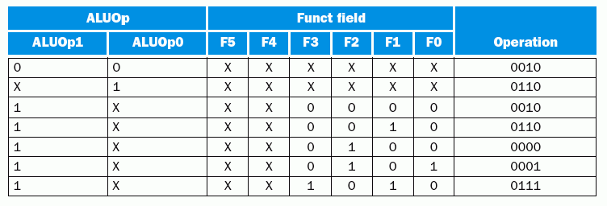

Introducción
============

En este trabajo se implementa y verifica un procesador DLX utilizando el 
lenguaje de programación Python_ mediante el uso del paquete MyHDL_. El 
proyecto se ha llamado **PyMIPS**. 

El DLX es básicamente un procesador MIPS revisado y simplificado con una arquitectura 
RISC de 32 bits y un pipeline de 5 etapas. (ver Segmentación_ ). Ha sido pensado 
principalmente para propósitos educativos, y se utiliza ampliamente en cursos de 
nivel universitario sobre arquitectura de computadoras.

El desarrollo de este trabajo ha sido guiado principalmente por el libro
[Computer Organization and Design]_, escrito por David Patterson y John 
Hennessy, diseñadores originales del procesador DLX. 

El código fuente, la documentación y la visualización de la historia de desarrollo
puede encontrarse en el sitio web http://github.com/nqnwebs/pymips. 
El trabajo ha sido liberado bajo licencia GNU GPL v3.0 [1]

Sobre el lenguaje
=================

Python es un lenguaje de programación de alto nivel cuya filosofía hace hincapié 
en una sintaxis clara y legible.

Se trata de un lenguaje de programación multiparadigma ya que soporta 
orientación a objetos, programación imperativa y funcional. Es un lenguaje interpretado, 
usa tipado dinámico, es fuertemente tipado y es multiplataforma.

MyHDL es un paquete (un conjunto de módulos y funciones Python) que permite utilizar 
la potencia de alto nivel de Python en reemplazo de un lenguaje de descripción de hardware 
tradicional. Más aun, con algunas restricciones menores, el código Python-MyHDL 
es convertible a VHDL o Verilog automáticamente. 

También es posible generar un archivo de descripción de forma de onda de las 
señales (archivos * .vcd *) implicadas en un determinado diseño. 

Es importante destacar que MyHDL_ permite valerse de la potencia de Python 
como lenguaje de alto nivel, pero sin salirse del *scope* de la descripción 
de hardware. Por ello, muchos conceptos son comunes (señales, bus, bits, 
enteros con y sin signo, testbench, etc) así como las técnicas de modelado
(estructural, comportamental, etc.). Semánticamente es muy similar a 
Verilog, aunque la posibilidad de instrospección de Python permite automatizar
e inferir aspectos, por ejemplo, el comportamiento de los puertos (se detecta
si es un puerto de entrada o salida). 

En el artículo [Why MyHDL]_ se detallan muchas ventajas de su uso. Entre ellas 
se destacan: 

 * Facilidad de uso: Python es mucho más fácil de aprender que VHDL o Verilog
 * Uso de técnicas modernas de desarrollo de software aplicadas al diseño de hardware:
   por ejemplo, pruebas unitarias, y la metodológia asociada *“test-driven development”*
 * Unificar diseño algoritmico y descripción de hardware
 * Centralizar el desarrollo cuando hay que codificar lo mismo en VHDL y Verilog
 * y mucho más... 

.. [1] http://www.gnu.org/licenses/gpl.html

.. _Python: http://python.org
.. _MyHDL: http://myhdl.org

.. [Why MyHDL]: *Why MyHDL?*, Jan Decaluwe, 2009, http://myhdl.org
.. [Computer Organization and Design]: *Computer Organization and Design, 3th 
                                        edition*, David Patterson and John 
                                        Hennessy, Morgan Kaufmman Publishers, 
                                        CA, 2005

Arquitectura
=============

Segmentación
------------

El interior del procesador DLX está segmentado en cinco etapas de pipeline y 
en cada una de ellas se realizarán las operaciones de las tareas en el ciclo 
normal de una instrucción, es decir, búsqueda de la instrucción 
(identificado con el bloque IF), decodificación de la instrucción 
(identificado con el bloque ID), ejecución de la operación 
(identificado con el bloque EX), acceso a memoria 
(identificado con el bloque MEM) y almacenamiento del resultado de la 
operación (identificado con el bloque WB). 

 .. image:: img/segmentation.png
    :align: center
    :width: 80 %

La ejecución de las instrucciones se superponen en el tiempo de la siguiente 
manera:

 .. image:: img/overlapping.png
    :width: 80 %
    :align: center

Etapas y Latchs
---------------

Los *latchs* se encargan de retener y estabilizar los datos entre las etapas.
manteniendo la integridad de las señales y permitiendo así altas 
velocidades de procesamiento. Son los componentes que permiten la paralelización 
de la etapas.  

Implementación
==============

El desarrollo de PyMIPS ha sido realizado iterativa e incrementalmente. En 
una primera estapa se codificó y verificó cada uno de los componentes internos
del procesador. Luego, a nivel estructural, se instanciaron y conectaron 
estos componentes (mediante señales internas) en una versión sin pipeline, 
(Datapath_), una versión con pipeline pero sin control de hazards (Pipeline_), 
y la versión definitiva con segmentación y control de hazards, 
mediante forwarding y detección de saltos (`DLX`). 

La codificación de cada componente respeta las restricciones RTL de MyHDL 
para ser convertible a lenguajes HDL sintetizables. En particular, para una 
una comparación, se incluye el resultado de conversión automática a VHDL 
estándar. 
 
Todos estos componentes han sido verificados y simulados mediante *testbenchs*
y/o *unittests*. Ambas técnicas permiten conectar señales a los puertos de 
entrada y salida del componte y observar su comportamiento en función de 
distintos estímulos que se generan. La diferencia radica en que los 
*unittest*, herramienta incluída en lenguajes orientados a objetos como Java 
y C++ y parte neurálgica de modelos de desarrollo ágiles, permiten la verificación automática comparando el estado de una señal en un determinado momento con un el valor esperado para esa condición. 

Esta automatización, en contraste con la inspección manual mediante el dump 
de forma de onda o la impresión por pantalla, permite una verificación mucho 
más fiable y rápida. 

Componentes
-----------

Program Counter
+++++++++++++++

El contador de programa funciona como un latch. Cuando llega el flanco de 
clock (descendiente), el valor del puerto de salida se actualiza con el valor 
del puerto de entrada en ese instante.

.. aafig::
    :aspect: 60
    :scale: 150
    :proportional:
    :align: center

            +---------+
            |         |
       IN >-|   PC    |-> Out
            |         |
            +---------+
                 ^
                Clk

.. literalinclude:: ../../program_counter.py
   :pyobject: program_counter

Luego de la conversión a VHDL, el código generado es el siguiente

.. literalinclude:: ../../vhdl/program_counter.vhd
    :lines: 12-

Para la verificación se realizó el siguiente *TestBench* que emula el uso en 
el contexto real donde el valor de salida (el contador) se incremeta a traves 
de un sumador 

.. literalinclude:: ../../program_counter.py
   :pyobject: testbench

El resultado es el siguiente:

.. program-output:: python /home/tin/facu/arq/project/program_counter.py
   :nostderr:

Instruction Memory
++++++++++++++++++

.. aafig::
    :aspect: 60
    :scale: 150
    :proportional:
    :align: center

              +----------------+
              |                |
     'Read' >-|   Instruction  |-> Instruction [31:0]
     'Addr'   |     Memory     |
              |                |
              +----------------+
                     ^
                    Clk

Una de las características de la arquitectura Hardvard del DLX es la 
separación de la memoria de programa de la memoria de datos. 
La memoria de programas funciona como una memoria ROM. En particular
el diseño implementado distribuye la memoria en bancos de 32 bits en vez de 
bytes. Esto tiene implicancia en que el incremento entre una instrucción 
y otra es de 1 en 1, en vez de ser de 4 como utiliza el diseño de la 
bibliografía. 

Cuando llega un flanco descendiente en el clock, el dato guardado en la 
dirección de memoria de entrada se asigna a la salida.

.. literalinclude:: ../../instruction_memory.py
   :pyobject: instruction_memory

Por simplicidad, no se incluye el código autogenerado de la conversión a 
VHDL, pero como para todos los componentes, puede encontrarse en la carpeta 
* ./vhdl *

Para cargar de información la memoria ROM, se escribió una pequeña función 
que lee un archivo de texto, considerando el *token* ``#`` como el inicio 
de un cometario. Además, no se consideran los espacios, de manera que el 
resultado es un número binario de 32 digitos (una instrucción de programa).

.. literalinclude:: ../../instruction_memory.py
   :pyobject: load_program

El testbench lee las 8 primeras posiciones:

.. literalinclude:: ../../instruction_memory.py
   :pyobject: testBench

cuyo resultado es el siguiente:

.. program-output:: python /home/tin/facu/arq/project/instruction_memory.py
   :nostderr:

Instruction Decoder
+++++++++++++++++++

En los 32 bits de instrucción se codifican distintas informaciones: opcode, 
función, registro source, target y destiny, etc. Para realizar esta 
separación se implementó un simple decodificador combinacional. 

.. literalinclude:: ../../instruction_decoder.py
   :pyobject: instruction_decoder

Unidad de control 
+++++++++++++++++

.. aafig::
    :aspect: 60
    :scale: 150
    :proportional:
    :align: center
    :textual:

              /----------------\
              |                |-> 'RegDst'
     NopSig >-|     Control    |-> 'Branch'
              |                |-> 'MemRead'
     Opcode >-|                |-> 'MemtoReg'
              |                |-> 'ALUOp (2bits)'
              |                |-> 'MemWrite'
              |                |-> 'ALUSrc'
              |                |-> 'RegWrite'
              \----------------/

La unidad de control es un componente combinacional que activa *flags*, en 
general para el control de multiplexores u otras unidades de control 
secundarias. Cumple la siguiente tabla de verdad:

.. image:: img/control_table.png
   :width: 90%
                    
Para satisfacer la detección de ``nop`` (instrucción ``0x00000``) se 
incorporó como entrada una señal detectada en ID, que es ``1`` si toda la 
instrucción es ``0``. En tal caso , la unidad de control pone todas sus 
salidas a ``0``.

La modificación  se debe a que el opcode ``00000`` es común para las 
instrucciones R-type y algunas señales de 
control se ponen a ``1`` causando efectos no deseados como la escritura en el 
banco de registros.

El código de implementación es el siguiente

.. literalinclude:: ../../control.py
   :pyobject: control

El testbench desarrollado itera sobre distintas entradas de opcode: 

.. literalinclude:: ../../control.py
   :pyobject: testBench

Cuyo salida estándar es la siguiente:

.. program-output:: python /home/tin/facu/arq/project/control.py
   :nostderr:

Multiplexores
+++++++++++++

Para seleccionar una u otra entrada en función de señales gestionadas por 
unidades de control se utilizan multiplexores, en particular de 2x32 (2 
canaes de 32 bits) y 4x32.

.. aafig::
    :aspect: 60
    :scale: 150
    :proportional:
    :align: center

            /-----\
      Ch0 >-|     |
            | MUX |-> Out
      Ch1 >-|     |
            \-----/
               ^
              Sel

Si el selector es 0, la salida se conectará con el canal 0, y análogamente 
si es 1 la salida será el canal 1. Para los multiplexores de 4 canales, el 
selector en una señal de 2 bits. 

.. literalinclude:: ../../mux.py
   :pyobject: mux2

El testbench genera entradas y selectores al azar e imprime la salida. Una 
salida es la siguiente:

.. program-output:: python /home/tin/facu/arq/project/mux.py
   :nostderr:

Banco de Registros
++++++++++++++++++

El DLX cuenta con un banco de 32 registros de propósito general. Tiene la 
particularidad de que en un mismo ciclo puede leer 2 registros 
simultáneamente (en el flanco de bajada) y escribir, si está habilitada la 
correspondiente señal de escritura, 1 registro en el flanco de subida del 
clock.

.. aafig::
    :aspect: 60
    :scale: 150
    :proportional:
    :align: center
    :textual:
                
                        RegWrite 
                           v
                           |
                  +----------------+
                  |                |-> ReadData1
       ReadReg1 >-|    Register    |
                  |     File       |-> ReadData2
       ReadReg2 >-|                |
                  |                |
       WriteReg >-|                |
                  |                |
      WriteData >-|                |
                  +----------------+
                          ^
                         Clk
ALU
+++

.. aafig::
    :aspect: 60
    :scale: 150
    :proportional:
    :align: center
    :textual:
                
                  
                  +-------+
                  |        \          
          Data1 >-+         \ 
                  +          \  
                   \          +
                    \         |
                     \  ALU   |-> Result
                     /        |    
                    /         |-> Zero     
                   /          +        
                  +          /
          Data2 >-+         /  
                  |        / 
                  +-------+        
                     ^
                    Control

La unidad aritmético-lógica es la encargada de realizar las operaciones. 
El operando de 32bits ``Data1`` recibe el dato del registro 1 (``Rs``) y ``Data2`` 
puede ser tanto otro dato almacenado en un registro (``Rt``) o bien un valor 
literal. Las operaciones que soporta esta implementación son las que se 
detallan en la siguiente tabla. 

.. image:: img/alu_op.png
   :align: center
 
La implementación es la siguiente: 

.. literalinclude:: ../../alu.py
   :pyobject: ALU

El testbench genera inputs al azar e intera sobre los valores de gestión 
válidos. La salida es la siguiente

:: 

    Control: 0000 | 252 AND 184 | 184 | z=0
    Control: 0001 | 137 OR 175 | 175 | z=0
    Control: 0010 | 113 add 148 | 261 | z=0
    Control: 0110 | 77 substract 166 | -89 | z=0
    Control: 0111 | 158 < 10 | 0 | z=1
    Control: 1100 | 238 NOR 237 | -240 | z=0

ALU Control
+++++++++++

La unidad de control de ALU es un componente combinacional de control 
secundario. Recibe una señal de 2 bits de la unidad de control y la función 
codificada en los 6 bits menos significativos de la instrucción.  
Genera la señal de control de 4 bits correspondiente para controlar la 
operación de la ALU. 

.. aafig::
    :aspect: 60
    :scale: 150
    :proportional:
    :align: center

            /---------\
    ALUop >-|         |
            |   ALU   |-> AluControl (4bits)
     Func >-| Control |    
            \---------/
               

La tabla de verdad es la siguiente:

La implementación es la siguiente: 

.. literalinclude:: ../../alu_control.py
   :pyobject: alu_control

El testbench se codificó de la siguiente manera:

.. literalinclude:: ../../alu_control.py
   :pyobject: testBench_alu_control

Sign Extender
+++++++++++++

El extensor de signo convierte un dirección (offset) o un literal codificado 
en 16 bits (bits 15 a 0 de la instrucción) en un entero de igual valor pero 
representado en 32 bits, lo que permite usarlo como operador en la ALU o en 
el sumador para saltos condicionales. 

.. aafig::
    :aspect: 60
    :scale: 150
    :proportional:
    :align: center

            +------------+
            |            |
     IN16 >-|   Sign     |-> Out32
            |  Extender  |
            |            |
            +------------+

.. literalinclude:: ../../sign_extender.py
   :pyobject: sign_extender

Se muestra tambien la conversión a VHDL

.. literalinclude:: ../../vhdl/sign_extender.vhd
    :lines: 12-

El resulado del testbench es el siguiente: 

.. program-output:: python /home/tin/facu/arq/project/sign_extender.py
   :nostderr:

Data Memory
+++++++++++

La memoria de datos (RAM) permite almacenar y recuperar información. En el 
MIPS y derivados, sólo se interactua con este dispositivo a través de las 
operaciones ``store`` y ``load``. 

.. aafig::
    :aspect: 60
    :scale: 150
    :proportional:
    :align: center
    :textual:
                
                        MemWrite 
                           v
                  +--------+-------+
                  |                +-> ReadData
        Address >-+     'Data'     |
                  |    'Memory'    |
      WriteData >-+                |
                  |                |
                  +--+-------+-----+
                     ^       ^
                    Clk    MemRead  

En cierta forma funciona similar al banco de registros, pero se lee una 
dirección a la vez y existen señales de habilitación tanto para escritura 
como para lectura. La lectura o la escritura se produce en el flanco de bajada 
de la señal de clock, teniendo prioridad la escritura, siempre y cuando las 
correspondientes señales estén en ``1``. 

La implementación es la siguiente

.. literalinclude:: ../../data_memory.py
   :pyobject: data_memory

La conversión a código VHDL se detalla a continuación:

.. literalinclude:: ../../vhdl/data_memory.vhd
    :lines: 12-

El testbench realiza escrituras de valores al azar (enteros con signo de 32 
bits) en 5 direcciones aleatorias. Luego realiza la lectura de esas 
direcciones. Se codificó de la siguiente manera:

.. literalinclude:: ../../data_memory.py
   :pyobject: testBench

y resultado se lista a continuación:

.. program-output:: python /home/tin/facu/arq/project/data_memory.py
   :nostderr:

Datapath
--------

 .. image:: img/datapath.png
    :width: 100 %

Pipeline
--------

DLX
---
